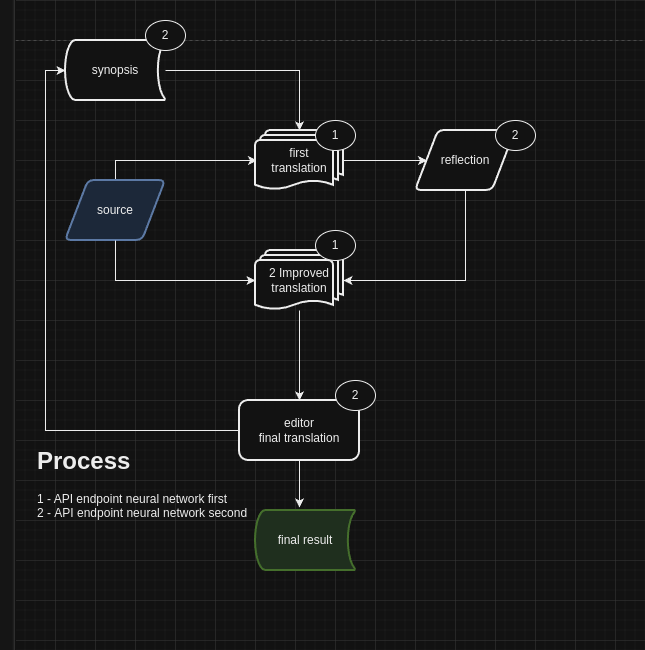

# Sunny Narrator v1.0

**AI translator for long texts** (FB2, EPUB, TXT) with vocabulary preservation and format integrity.



## Features

- 📚 **Format preservation**: Native FB2/EPUB support with XML tag integrity
- 🎯 **Vocabulary translation**: NER-based consistent name/term handling
- 📝 **Proofreading**: Dual-pass translation with quality check
- 🌍 **Regional adaptation**: Country-specific language nuances
- 😄 **Style preservation**: Humor and context-aware translation
- 🐳 **Docker ready**: One-command deployment with GPU support

## Quick Start

### Docker (Recommended)

```bash
git clone https://github.com/neowisard/sunny_narrator
cd sunny_narrator

# Setup and run
./scripts/check-gpu.sh
docker-compose -f docker-compose.gpu.yml build
docker-compose -f docker-compose.gpu.yml run --rm sunny-narrator
```

### Python

```bash
pip install -r requirements.txt
python app.py
```

## Requirements

| Component | Minimum | Recommended |
|-----------|---------|-------------|
| GPU | NVIDIA 4GB VRAM | 8GB+ VRAM |
| RAM | 8GB | 16GB+ |
| API | OpenAI-compatible | llama.cpp, OpenAI, Claude |

## Target Audience

| Segment | Fit |
|---------|-----|
| **Technical translators** | ⭐⭐⭐ Excellent |
| **Indie authors** | ⭐⭐ Good |
| **Book enthusiasts** | ⭐ Moderate |

## Documentation

- [Docker Setup](DOCKER_README.md) — GPU/CPU deployment
- [Configuration](docs/CONFIGURATION.md) — Environment variables
- [Architecture](docs/ARCHITECTURE.md) — System design
- [Changelog](docs/CHANGELOG.md) — Release history

## Wiki

📖 [Full Documentation](https://github.com/NW15D/sunny-narrator/wiki)

## Languages

- [🇷🇺 Russian](README_RU.md)
- [🇨🇳 Chinese](README_CN.md)
- [🇧🇷 Portuguese](README_PT.md)

---

Made for book lovers. [MIT License](LICENSE)
