# Sunny Narrator

**Versão:** 1.4  
Programa de tradução de livros para formatos FB2/EPUB.  
Sistema de tradução AI com controle de qualidade em 5 estágios.

## 🔄 Workflow Geral

```mermaid
flowchart LR
    A[1. Clonar repositório] --> B[2. Instalar dependências Python]
    B --> C[3. Baixar dicionários spaCy]
    C --> D[4. Configurar arquivo .env]
    D --> E[5. Converter livro para book.fb2]
    E --> F[6. Executar python app.py → book.dic]
    F --> G[7. Editar/verificar/limpar dicionário]
    G --> H[8. Iniciar tradução]
    H --> I[9. Corrigir erros de formato FB2 no editor de texto]
    I --> J[10. Ler e revisar o livro]
```



**Workflow passo a passo:**
1. **Clone o repositório** - `git clone` o projeto
2. **Instale as dependências** - `pip install -r requirements.txt`
3. **Baixe os dicionários spaCy** - para o idioma de origem
4. **Configure** - Crie `.env` a partir de `.env.example` e preencha as chaves da API
5. **Prepare o livro** - Converta seu livro para o formato `book.fb2`
6. **Execute o programa** - `python app.py` - produz o arquivo de dicionário `book.dic`
7. **Edite o dicionário** - Revise e limpe `book.dic` ( remova erros, adicione correções)
8. **Inicie a tradução** - Execute `python app.py` para traduzir o livro
9. **Corrija erros de formato** - No editor de texto: remova tags extras, corrija colchetesduplos, corrija erros de tradução, etc.
10. **Leia e revise** - Revisão final do livro traduzido

---

## 🚀 Início Rápido

```bash
# Instalar dependências
pip install -r requirements.txt

# Configurar .env
cp .env.example .env
# Edite .env com suas chaves de API

# Executar tradução (modo JSON recomendado)
python app.py
```

**Documentação completa:** [docs/](docs/)

---

## 📋 Configuração

### .env Básico

```bash
# Configurações de API
API_KEY_TRANSLATE=your-key
API_BASE_TRANSLATE=http://localhost:11434/v1
MODEL_TRANSLATE=google/gemma-2-27b-it
JSON_MODE=true    # 🚀 Recomendado: JSON estruturado

API_KEY_PROOFREAD=your-key
API_BASE_PROOFREAD=http://localhost:11434/v1
MODEL_PROOFREAD=Mistral

# Idiomas
SOURCE_LANG=english
TARGET_LANG=portuguese

# Processamento
FAST_TRANS=false    # Modo rápido
DEBUG=off
```

**Todas opções:** [docs/CONFIGURATION.md](docs/CONFIGURATION.md)

---

## ⚡ Modo FAST_TRANS

**Usar `FAST_TRANS=true` para:**
- ✅ Rascunho de tradução
- ✅ Documentos técnicos
- ❌ Não para publicação final ou tradução literária

**Velocidade:** ~2.5x mais rápido

**Detalhes:** [docs/FAST_TRANS.md](docs/FAST_TRANS.md)

---

## 📎 Vocabulário

Arquivo de dicionário (`*.dic`) garante consistência de terminologia:

```dic
# Formato: source = target, category, gender, notes
Alice = Alice, PERSON, she, Personagem principal
```

**Formato:** [docs/DICTIONARY_FORMAT.md](docs/DICTIONARY_FORMAT.md)

---

## 📖 Tradução Guided by Glossary (Série de Livros)

Crie um dicionário unificado para uma série de livros para garantir terminologia consistente em todos os volumes.

### Construir Dicionário de Série

```bash
# Uso básico
python app.py --build-series-dict books/ --series-dict-output series.dic

# Com limites personalizados
python app.py --build-series-dict books/ --series-dict-output series.dic --min-count-ner 3 --min-count-word 5
```

**Parâmetros:**
- `--build-series-dict` — Caminho para a pasta contendo livros FB2/EPUB/TXT
- `--series-dict-output` — Arquivo de dicionário de saída (padrão: `series.dic`)
- `--min-count-ner` — Número mínimo de ocorrências para entidades NER (padrão: 5)
- `--min-count-word` — Número mínimo de ocorrências para palavras comuns (padrão: 10)

**Workflow:**
1. Encontrar todos os arquivos de livros na pasta
2. Extrair texto de cada livro
3. Executar NER para encontrar entidades nomeadas (PERSON, ORG, LOC, GPE)
4. Agregar contagens em todos os livros
5. Filtrar por critérios de limite
6. Traduzir termos via LLM
7. Salvar arquivo `.dic` unificado

**Saída:** formato JSON do dicionário com campo `book_origin` mostrando qual livro cada termo veio.

---

## 💾 Continuar após Falha

Salvamento automático de progresso após cada chunk:

```bash
# Interrompido em 50%
python app.py  # Ctrl+C

# Retomar automaticamente
python app.py  # ✓ Retomando do chunk 51/100
```

**Detalhes:** [docs/RESUME.md](docs/RESUME.md)

---

## 🐳 Docker

**CPU-only (padrão):**
```bash
docker-compose up -d
```

**GPU (NVIDIA):**
```bash
docker-compose -f docker-compose.gpu.yml up -d
```

**Guia:** [docs/DOCKER_CPU_GUIDE.md](docs/DOCKER_CPU_GUIDE.md)

---

## 📚 Documentação

| Tópico | Arquivo |
|--------|---------|
| **Instalação** | [docs/INSTALLATION.md](docs/INSTALLATION.md) |
| **Configuração** | [docs/CONFIGURATION.md](docs/CONFIGURATION.md) |
| **Estágios de Tradução** | [docs/TRANSLATION_STAGES.md](docs/TRANSLATION_STAGES.md) |
| **Formato de Dicionário** | [docs/DICTIONARY_FORMAT.md](docs/DICTIONARY_FORMAT.md) |
| **Retomar após Falha** | [docs/RESUME.md](docs/RESUME.md) |
| **Docker** | [docs/DOCKER_CPU_GUIDE.md](docs/DOCKER_CPU_GUIDE.md) |
| **JSON Mode** | [docs/JSON_MODE_ANALYSIS.md](docs/JSON_MODE_ANALYSIS.md) —Modo JSON estruturado |

---

## 📝 Versões

- **v1.4** — Adicionado diagrama de workflow geral e instruções passo a passo ao README
- **v1.3** — README em inglês inicial
- **v1.11** — Checkpoint/resume, Docker CPU
- **v1.10** — Simplificação remove_tags
- **v1.9** — Pipeline de 5 estágios
- **v1.0** — Lançamento inicial

---

[English](README.md) | [Русский](README_RU.md) | [中文](README_CN.md)
