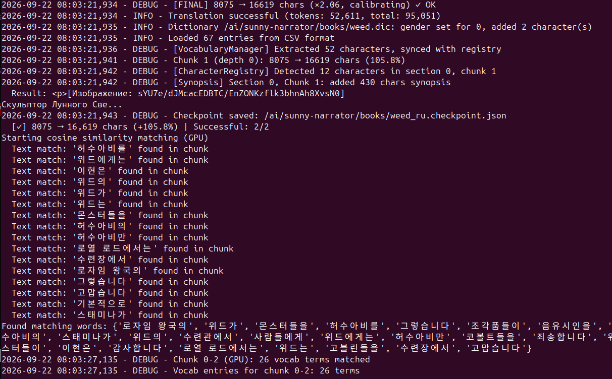

# Sunny Narrator

**Versão:** 2.8  
**Tradutor de livros guiado por glossário (AI book translator)** para FB2/TXT/EPUB/DOCX/PDF — um tradutor de ficção baseado em LLM (LLM fiction book translator), com sistema de tradução em dois LLMs e controle de qualidade em 5 estágios.

🖥️ **Utilitário de linha de comando (CLI)** — sem interface gráfica; recomenda-se experiência básica com terminal.

**Projetado para:**
- 📚 Tradução de séries de livros guiada por glossário (terminologia consistente em todos os volumes)
- 🔨 Criação de dicionários para traduções de livros e séries
- 💻 GPUs locais (16-24 GB VRAM) via llama.cpp, Ollama, LM Studio etc. e qualquer API compatível com OpenAI (3-4 milhões de tokens por livro)
- ☁️ Serviços de tradução online via API
- 🎓 Tradutores profissionais e não profissionais — para gerar rascunhos de tradução de livros e dicionários

## 🔄 Workflow Geral

### Formatos Suportados

| Formato de entrada | Pipeline |
|--------------------|----------|
| **FB2, TXT** | Pipeline clássico (XML direto — preserva a estrutura poem/stanza/v) |
| **DOCX, EPUB, PDF** | Pipeline Calibre (via HTMLZ intermediário) |

O pipeline é escolhido automaticamente pela extensão do arquivo — a flag `--pipeline` não é necessária.


```mermaid
flowchart LR
    A[1. Clonar repositório] --> B[2. Instalar dependências]
    B --> C[3. Configurar .env]
    C --> D[4. Indicar o livro em FILE]
    D --> E[5. python app.py → book.dic]
    E --> F[6. Revisar/limpar dicionário]
    F --> G[7. python app.py → tradução]
    G --> H[8. Revisar o livro]
```

**Workflow passo a passo:**
1. **Clonar repositório** — `git clone` do projeto
2. **Instalar dependências** — `pip install -e .` (usa `pyproject.toml`); para DOCX/EPUB/PDF instale também `pandoc` e `calibre`
3. **Configurar** — crie `.env` a partir de `env.sample`, preencha as chaves de API e `SOURCE_LANG`/`TARGET_LANG`
4. **Escolher o livro** — `FILE=path/to/book.fb2` (ou `.txt`, `.epub`, `.docx`, `.pdf`)
5. **Criar o dicionário** — `python app.py` cria `book.dic` ao lado do livro (o modelo spaCy do idioma de origem é baixado automaticamente). A execução para aqui para revisão (todos os formatos)
6. **Editar o dicionário** — revise e limpe `book.dic` (remova erros, corrija traduções, indique gêneros)
7. **Traduzir** — execute `python app.py` novamente; o resultado é salvo ao lado do arquivo original, com um marcador de idioma no nome
8. **Ler e revisar** — revisão final do livro traduzido

---

## 🚀 Início Rápido

```bash
# Instalar dependências
pip install -e .

# Configurar .env
cp env.sample .env
# Edite .env: chaves de API, SOURCE_LANG, TARGET_LANG

# Qualquer formato: a primeira execução cria o dicionário, a segunda traduz
FILE=books/mybook.fb2 python app.py
```

**Documentação completa:** [docs/](docs/)

---

## 📋 Configuração

Copie o `env.sample` incluído para `.env`. É uma configuração completa e funcional: o **Gemma 4** traduz e o **Qwen 3.6** revisa, ambos por meio de um servidor compatível com OpenAI (llama.cpp, Ollama, LM Studio, vLLM ou uma API online). Cada opção está documentada no próprio arquivo, e no final há variantes prontas: dois servidores llama.cpp, um servidor Ollama, original em inglês, FB2 → EPUB e rascunho rápido.

```bash
cp env.sample .env
```

Depois ajuste pelo menos estas chaves:

```bash
# LLM de tradução — Gemma 4
API_KEY_TRANSLATE=your-api-key-here        # qualquer string não vazia para um servidor local
API_BASE_TRANSLATE=http://localhost:11434/v1
MODEL_TRANSLATE=Gemma4-26B                 # nome do modelo como o servidor o informa

# LLM de revisão — Qwen 3.6
API_KEY_PROOFREAD=your-api-key-here
API_BASE_PROOFREAD=http://localhost:11434/v1
MODEL_PROOFREAD=Qwen36-35B

# Livro e idiomas
FILE=books/mybook.fb2
SOURCE_LANG=ko
TARGET_LANG=ru

# Saída: fb2 ou epub para FB2/TXT; epub, docx ou pdf para EPUB/DOCX/PDF
OUTPUT_FORMAT=fb2
```

**Todas as opções:** [docs/CONFIGURATION.md](docs/CONFIGURATION.md)

---

## ⚡ Modo FAST_TRANS

**Use `FAST_TRANS=true` (ou `--fast-mode`) para:**
- ✅ Tradução de rascunho
- ✅ Documentação técnica
- ❌ NÃO para publicação final ou tradução literária

**Velocidade:** ~2.5x mais rápido (2 estágios em vez de 5)

**Detalhes:** [docs/FAST_TRANS.md](docs/FAST_TRANS.md)

---

## 📏 Calibração do Tamanho dos Chunks

Após a tradução de cada chunk, seu tamanho é verificado em relação a uma proporção esperada source→target, para detectar traduções truncadas ou infladas. Em vez de um limite fixo, a proporção é calibrada automaticamente por livro: os 3 primeiros chunks aceitos só são verificados contra falhas grosseiras (×0,25 … ×5); depois disso, a proporção esperada passa a ser a mediana dos chunks já aceitos.

**Detalhes:** [docs/RECHUNKING_GUIDE.md](docs/RECHUNKING_GUIDE.md)

---

## 📎 Vocabulário

O arquivo de dicionário (`*.dic`) garante a consistência da terminologia:

```dic
# Formato: source = target, category, gender, notes
Alice = Алиса, PERSON, she, Personagem principal
```

- Criado automaticamente na primeira execução via NER (entidades nomeadas) e depois traduzido pelo LLM. Palavras comuns frequentes só são adicionadas com `DICT_FREQUENT_WORDS=true` (ou `--frequent-words` para `--build-dict`/`--build-series-dict`).
- **Gênero dos personagens** (`he`, `she`, `it`, `they`): se o dicionário não indica o gênero, o estágio de sinopse o determina pelo texto; personagens com nome próprio ausentes do dicionário são adicionados. Um gênero já presente no arquivo nunca é sobrescrito — edições manuais sempre prevalecem.
- **Palavras inventadas:** além dos personagens, a etapa de sinopse informa palavras inventadas sem tradução comum (`spidergun`); elas são adicionadas como `TERM`. Palavras que o modelo spaCy já conhece são descartadas.
- **Sem duplicatas:** um candidato que o dicionário já cobre não é adicionado — outra caixa ou forma flexionada de uma entrada (`Jain nodes` = `Jain node`, `Gabbleducks` = `gabbleduck`; um nome só pela flexão: `Jains` = `Jain`, mas `Marie` ≠ `Mary`) ou uma frase com um termo conhecido (`Jain node`, `Jain-tech` quando `Jain` existe). Hífen, espaço ou escrita junta são entradas diferentes (`gabble-duck` ≠ `gabbleduck`); uma sigla em MAIÚSCULAS só corresponde a si mesma (`ECS` ≠ `EC`).
- **Para onde vão as entradas encontradas:** novos nomes e termos entram logo no dicionário em memória — os chunks seguintes da execução os usam, e uma execução retomada os restaura do checkpoint. Só são gravados no `.dic` com `DICT_AUTO_SAVE=true` (padrão `false`: o dicionário revisado fica como está).
- **Busca de termos:** igual para todos os formatos — só os termos do dicionário encontrados num chunk entram no seu prompt. Formas flexionadas são encontradas (`spidergun` → `spiderguns`, `wolf` → `wolves`), termos em chinês/japonês/coreano são buscados como substrings, e um termo nunca é encontrado dentro de outra palavra (`Ann` / `Annoying`).
- **Termos de várias palavras primeiro:** um termo com mais palavras vence os mais curtos que ele contém (`Mad Hatter` sobre `Hatter`); depois vence o mais longo. Um termo curto que aparece só dentro de um longo não entra no prompt, e o modelo não recebe duas traduções da mesma expressão.
- **Termos substituídos antes da tradução:** as traduções dos termos do dicionário encontrados no trecho são colocadas no texto de origem antes da primeira etapa, para o modelo não os ignorar (as etapas seguintes veem o original). Marcação, links e URLs nunca são alterados; um termo em minúsculas é encontrado em qualquer caixa, um nome como escrito ou em MAIÚSCULAS.
- **Outro idioma de destino:** `python scripts/convert_dic.py books/MyBook.dic fr es zh` converte um dicionário pronto para outros idiomas (`MyBook_fr.dic`, …), usando a tradução existente como dica.
- **Caminho explícito do dicionário:** por padrão o dicionário é procurado ao lado do livro (`books/MyBook.fb2` → `books/MyBook.dic`). Para usar outro arquivo, por exemplo um dicionário comum da série, defina `DICTIONARY=path/to/file.dic` no `.env` ou passe `--dictionary path/to/file.dic` (a flag da CLI tem prioridade). Funciona nos dois pipelines; um arquivo inexistente é criado nesse caminho (o diretório deve existir).

**Guia de formato:** [docs/DICTIONARY_FORMAT.md](docs/DICTIONARY_FORMAT.md)

---

## 🈶 Idiomas CJK (coreano, japonês, chinês)

Livros podem ser traduzidos diretamente de idiomas CJK para qualquer idioma, com dicionário:

- **NER:** `ko_core_news_lg` usa seu próprio esquema de rótulos KLUE (`PS`/`LC`/`OG`) — ele é reconhecido e normalizado para `PERSON`/`LOC`/`ORG`.
- **Busca no dicionário:** termos CJK são encontrados como substrings — não há espaços entre as palavras, e as partículas coreanas são escritas junto ao substantivo (`철수는`).
- **Modelos:** `python -m spacy download ko_core_news_lg` (nada extra); `ja_core_news_lg` e `zh_core_web_lg` precisam de tokenizadores: `pip install -e ".[cjk]"`.
- **Partículas coreanas:** as entidades vão para o dicionário sem a partícula colada (`철수는` → `철수`, `서울에서` → `서울`), então o termo encontra todas as formas da palavra. Pela busca por substring, um nome curto também é encontrado dentro de um mais longo (`철수` em `김철수`) — confira esses termos no `.dic` gerado.
- **Prioridade:** o termo mais longo vence (`魔王城` sobre `魔王`); um termo latino dentro de texto CJK (`ABC社`, inclusive o `ＡＢＣ` de largura total) é substituído como palavra própria.
- **Palavras frequentes** (só com `DICT_FREQUENT_WORDS=true`): tamanho mínimo de palavra de 2 caracteres em vez de 5 (uma palavra CJK costuma ter 1-3 caracteres).
- **Controle de tamanho:** traduzido para idiomas alfabéticos, um texto CJK cresce 2-4 vezes em caracteres. A proporção esperada é aprendida com o próprio livro — a mediana dos chunks aceitos; os 3 primeiros chunks são verificados apenas contra falhas grosseiras (×0,25 … ×5).

```bash
SOURCE_LANG=korean
TARGET_LANG=russian
```

---

## 🌍 Idiomas Testados

Qualquer idioma que o LLM escreva funciona como destino; o código do dicionário leva o idioma em conta. Verificado até agora:

| | Idiomas |
|---|---|
| **Traduções reais de livros** | inglês → russo, coreano → russo |
| **Origem, modelo spaCy real** (NER, formas dos termos, limpeza de artigos/partículas) | inglês, coreano, japonês, chinês, russo, alemão, francês, espanhol, português, italiano |
| **Origem, limitado** | turco (NER multilíngue; um termo só é encontrado na forma escrita no `.dic`) |
| **Destino, testes automatizados** | russo, turco (os cinco estágios com um LLM simulado), alemão, chinês |

**Detalhes e limites:** [docs/LANGUAGES.md](docs/LANGUAGES.md)

---

## 📖 Tradução Guiada por Glossário (Série de Livros)

Crie um dicionário unificado para uma série de livros, garantindo terminologia consistente em todos os volumes.

### Construir Dicionário de Série

```bash
# Uso básico
python app.py --build-series-dict books/ --series-dict-output series.dic

# Com limites personalizados
python app.py --build-series-dict books/ --series-dict-output series.dic --min-count-ner 3 --frequent-words --min-count-word 5
```

**Parâmetros:**
- `--build-series-dict` — pasta com livros FB2/EPUB/TXT
- `--series-dict-output` — arquivo de dicionário de saída (padrão: `series.dic`)
- `--min-count-ner` — ocorrências mínimas para entidades NER (padrão: 2)
- `--frequent-words` — adicionar também palavras comuns frequentes, não só entidades nomeadas (padrão: desligado, `DICT_FREQUENT_WORDS`)
- `--min-count-word` — ocorrências mínimas para palavras comuns com `--frequent-words` (padrão: 5)

O dicionário de um único livro é criado com `--build-dict path/to/book`.

**Workflow:**
1. Encontrar todos os arquivos de livros na pasta
2. Extrair o texto de cada livro
3. Executar NER para encontrar entidades nomeadas (PERSON, ORG, LOC, GPE, EVENT, FAC, PRODUCT)
4. Somar as contagens de todos os livros
5. Filtrar pelos limites
6. Traduzir os termos via LLM de revisão (proofread)
7. Salvar um `.dic` unificado

**Saída:** um arquivo `.dic` comum (`source = target, category, gender, notes`). Nomes próprios mantêm as maiúsculas e todas as palavras (`John Smith`).

---

## 💾 Continuar após Falha

O progresso é salvo automaticamente após cada chunk:

```bash
# Interrompido em 50%
python app.py  # Ctrl+C

# Retomar automaticamente
python app.py  # ✓ Retomando do chunk 51/100
```

Para DOCX/EPUB/PDF, `--fresh` ignora o checkpoint e recomeça do zero.

**Detalhes:** [docs/RESUME.md](docs/RESUME.md)

---

## 🐳 Docker

**GPU (NVIDIA):**
```bash
docker-compose up -d
```

**Somente CPU:**
```bash
docker-compose -f docker-compose.cpu.yml up -d
```

**Imagem GPU pré-compilada** ([GitHub Container Registry](https://github.com/NW15D/sunny-narrator/pkgs/container/sunny-narrator), compilada a partir do `Dockerfile` a cada push para `main`):
```bash
docker pull ghcr.io/nw15d/sunny-narrator:main
```

**Guias:** [docs/DOCKER_CPU_GUIDE.md](docs/DOCKER_CPU_GUIDE.md), [docs/GPU_DOCKER.md](docs/GPU_DOCKER.md)

---

## 🔄 Pipeline Calibre (DOCX/EPUB/PDF)

Aceita **DOCX/EPUB/PDF** diretamente — sem conversão manual.
O pipeline é escolhido automaticamente para arquivos `.docx`, `.epub` ou `.pdf`.

```bash
# Instalar dependências do sistema
sudo apt install pandoc calibre
pip install -e .

# Traduzir DOCX/EPUB/PDF (detectado pela extensão)
FILE=books/mybook.epub python app.py --output-format epub
```

**Pipeline:** DOCX/EPUB/PDF → Calibre → HTML → Markdown → Tradução → HTML → Calibre → DOCX/EPUB/PDF

A marcação interna do Calibre (âncoras `calibre_link-*`, classes `.calibre`) é removida automaticamente, e o sumário é reconstruído a partir dos títulos traduzidos.

> ⚠️ **FB2 NÃO é suportado pelo pipeline Calibre.** O FB2 tem uma estrutura
> rica (poem/stanza/v) que o HTMLZ intermediário achata em parágrafos simples —
> uma perda de qualidade irreversível. Para FB2 use o **pipeline clássico**
> (padrão para `.fb2` e `.txt`): ele manipula o XML diretamente e preserva
> toda a estrutura do livro.

**FB2 → EPUB:** `FILE=books/mybook.fb2 python app.py --output-format epub` (ou `OUTPUT_FORMAT=epub` no `.env`). O pipeline clássico traduz o FB2 e monta o EPUB diretamente a partir dele: sumário aninhado, notas, capa, imagens, poemas e epígrafes.

**Guia completo:** [docs/INSTALLATION.md](docs/INSTALLATION.md#-calibre-pipeline-auto-detected)

---

## 📜 Logs

O log do console mostra cada etapa da tradução: verificações de tamanho com a proporção calibrada, gêneros gravados no dicionário, termos do dicionário encontrados no chunk, checkpoints.



- `DEBUG=on` — log detalhado (verificações de tamanho, correspondência do dicionário, sinopse)
- `DEBUG_HTTP=on` — também os rastros HTTP brutos dos clientes LLM
- `LLM_LOGGING=true` — cada chamada ao LLM (prompts, resposta, tokens, tempo) como linhas JSON em `logs/llm_calls_YYYY-MM-DD.log` (diretório: `LLM_LOGGING_DIR`)

**Detalhes:** [docs/LOGGING.md](docs/LOGGING.md)

---

## 📚 Documentação

| Tópico | Arquivo |
|--------|---------|
| **Instalação** | [docs/INSTALLATION.md](docs/INSTALLATION.md) |
| **Configuração** | [docs/CONFIGURATION.md](docs/CONFIGURATION.md) |
| **Modo FAST_TRANS** | [docs/FAST_TRANS.md](docs/FAST_TRANS.md) |
| **Estágios de tradução** | [docs/TRANSLATION_STAGES.md](docs/TRANSLATION_STAGES.md) |
| **Estratégia de temperatura** | [docs/TEMPERATURE_STRATEGY.md](docs/TEMPERATURE_STRATEGY.md) |
| **Rechunking** | [docs/RECHUNKING_GUIDE.md](docs/RECHUNKING_GUIDE.md) |
| **NER** | [docs/NER_GUIDE.md](docs/NER_GUIDE.md) |
| **Formato do dicionário** | [docs/DICTIONARY_FORMAT.md](docs/DICTIONARY_FORMAT.md) |
| **Continuar após falha** | [docs/RESUME.md](docs/RESUME.md) |
| **Logs** | [docs/LOGGING.md](docs/LOGGING.md) |
| **Docker (CPU)** | [docs/DOCKER_CPU_GUIDE.md](docs/DOCKER_CPU_GUIDE.md) |
| **Docker (GPU)** | [docs/GPU_DOCKER.md](docs/GPU_DOCKER.md) |
| **Modo JSON** | [docs/JSON_MODE_ANALYSIS.md](docs/JSON_MODE_ANALYSIS.md) |
| **Guia de prompts** | [docs/PROMPTS_GUIDE.md](docs/PROMPTS_GUIDE.md) |
| **Idiomas testados** | [docs/LANGUAGES.md](docs/LANGUAGES.md) |

---

## 📝 Histórico de Mudanças

Histórico de versões: [CHANGELOG.md](CHANGELOG.md)

---

[English](README.md) | [Русский](README_RU.md) | [中文](README_CN.md) | [Türkçe](README_TR.md)
