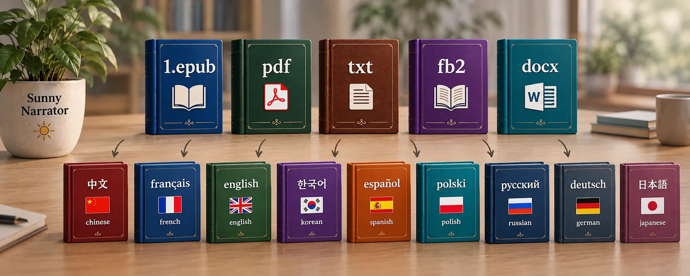

# Sunny Narrator

<p align="center">
  
</p>

[](https://github.com/NW15D/sunny-narrator/actions/workflows/tests.yml)
[](https://github.com/NW15D/sunny-narrator/pkgs/container/sunny-narrator)
[](https://github.com/NW15D/sunny-narrator/commits/main)
[](LICENSE)

**Sürüm:** 2.7  
**Sözlük güdümlü yapay zekâ kitap çevirmeni (AI book translator)** — FB2/TXT/EPUB/DOCX/PDF için, iki LLM'li çeviri ve 5 aşamalı kalite kontrolü olan, LLM tabanlı bir kurgu kitap çevirmeni.

🖥️ **Konsol uygulaması (CLI)** — grafik arayüz yoktur; temel komut satırı deneyimi önerilir.

**Ne için tasarlandı:**
- 📚 Kitap serilerinin sözlük güdümlü çevirisi (tüm ciltlerde tutarlı terminoloji)
- 🔨 Kitap ve seri çevirileri için sözlük oluşturma
- 💻 llama.cpp, Ollama, LM Studio vb. ile yerel GPU'lar (16-24 GB VRAM) ve OpenAI uyumlu her API (kitap başına 3-4 milyon token)
- ☁️ API üzerinden çevrimiçi çeviri hizmetleri
- 🎓 Profesyonel ve amatör çevirmenler — kitap çevirisi taslakları ve sözlükler hazırlamak için

## 🔄 Genel İş Akışı

### Desteklenen Biçimler

| Girdi biçimi | İşlem hattı |
|--------------|-------------|
| **FB2, TXT** | Klasik hat (doğrudan XML — poem/stanza/v yapısını korur) |
| **DOCX, EPUB, PDF** | Calibre hattı (ara biçim HTMLZ üzerinden) |

İşlem hattı dosya uzantısına göre otomatik seçilir — `--pipeline` bayrağı gerekmez.


**Adım adım:**
1. **Depoyu klonlayın** — projeyi `git clone` ile indirin
2. **Bağımlılıkları kurun** — `pip install -e .` (`pyproject.toml` kullanılır); DOCX/EPUB/PDF için ayrıca `pandoc` ve `calibre` kurun
3. **Ayarlayın** — `env.sample` dosyasından `.env` oluşturun, API anahtarlarını ve `SOURCE_LANG`/`TARGET_LANG` değerlerini girin
4. **Kitabı seçin** — `FILE=path/to/book.fb2` (veya `.txt`, `.epub`, `.docx`, `.pdf`)
5. **Sözlüğü oluşturun** — `python app.py` kitabın yanında `book.dic` dosyasını oluşturur (kaynak dilin spaCy modeli otomatik indirilir). Gözden geçirebilmeniz için çalışma burada durur (tüm biçimlerde)
6. **Sözlüğü düzenleyin** — `book.dic` dosyasını gözden geçirip temizleyin (hataları silin, çevirileri düzeltin, cinsiyetleri belirtin)
7. **Çevirin** — `python app.py` komutunu tekrar çalıştırın; sonuç, adında dil işareti bulunan bir dosya olarak kaynak dosyanın yanına yazılır
8. **Okuyun ve düzeltin** — çevrilmiş kitabın son kontrolü

---

## 🚀 Hızlı Başlangıç

```bash
# Bağımlılıkları kurun
pip install -e .

# .env dosyasını ayarlayın
cp env.sample .env
# .env içinde: API anahtarları, SOURCE_LANG, TARGET_LANG

# Her biçimde: ilk çalıştırma sözlüğü oluşturur, ikincisi çevirir
FILE=books/mybook.fb2 python app.py
```

**Tüm belgeler:** [docs/](docs/)

---

## 📋 Yapılandırma

Paketle gelen `env.sample` dosyasını `.env` olarak kopyalayın. Bu, eksiksiz ve çalışan bir yapılandırmadır: **Gemma 4** çevirir, **Qwen 3.6** düzeltir; ikisi de OpenAI uyumlu bir sunucu üzerinden çalışır (llama.cpp, Ollama, LM Studio, vLLM veya barındırılan bir API). Her seçenek dosyanın içinde açıklanmıştır; dosyanın sonunda hazır varyantlar bulunur: iki llama.cpp sunucusu, tek Ollama sunucusu, İngilizce kaynak, FB2 → EPUB ve hızlı taslak.

```bash
cp env.sample .env
```

Ardından en azından şu anahtarları ayarlayın:

```bash
# Çeviri LLM'i — Gemma 4
API_KEY_TRANSLATE=your-api-key-here        # yerel sunucu için boş olmayan herhangi bir dize
API_BASE_TRANSLATE=http://localhost:11434/v1
MODEL_TRANSLATE=Gemma4-26B                 # sunucunuzun bildirdiği ad

# Düzeltme LLM'i — Qwen 3.6
API_KEY_PROOFREAD=your-api-key-here
API_BASE_PROOFREAD=http://localhost:11434/v1
MODEL_PROOFREAD=Qwen36-35B

# Kitap ve diller
FILE=books/mybook.fb2
SOURCE_LANG=english
TARGET_LANG=turkish
# COUNTRY boş bırakılırsa hedef dilden belirlenir (turkish → Türkiye)

# Çıktı: FB2/TXT için fb2 veya epub; EPUB/DOCX/PDF için epub, docx veya pdf
OUTPUT_FORMAT=fb2
```

**Tüm seçenekler:** [docs/CONFIGURATION.md](docs/CONFIGURATION.md)

---

## ⚡ FAST_TRANS Modu

**`FAST_TRANS=true` (veya `--fast-mode`) şunlar için:**
- ✅ Taslak çeviri
- ✅ Teknik belgeler
- ❌ Son yayın veya edebî çeviri için DEĞİL

**Hız:** ~2,5 kat daha hızlı (5 yerine 2 aşama)

**Ayrıntılar:** [docs/FAST_TRANS.md](docs/FAST_TRANS.md)

---

## 📏 Parça Uzunluğu Kalibrasyonu

Her parça çevrildikten sonra uzunluğu, kesilmiş veya şişmiş çıktıyı yakalamak için beklenen kaynak→hedef oranıyla karşılaştırılır. Sabit bir eşik yerine oran her kitap için otomatik ayarlanır: kabul edilen ilk 3 parça yalnızca kaba hatalar için denetlenir (×0,25 … ×5), ardından beklenen oran o ana kadar kabul edilen parçaların medyanı olur.

**Ayrıntılar:** [docs/RECHUNKING_GUIDE.md](docs/RECHUNKING_GUIDE.md)

---

## 📎 Sözlük

Sözlük dosyası (`*.dic`) terminoloji tutarlılığını sağlar:

```dic
# Format: source = target, category, gender, notes
Alice = Alice, PERSON, she, Ana karakter
```

- İlk çalıştırmada NER (adlandırılmış varlıklar) ile otomatik oluşturulur, ardından LLM tarafından çevrilir. Sık geçen sıradan sözcükler yalnızca `DICT_FREQUENT_WORDS=true` ile eklenir (`--build-dict`/`--build-series-dict` için `--frequent-words`).
- **Karakter cinsiyetleri** (`he`, `she`, `it`, `they`): sözlükte cinsiyet yoksa özet aşaması metinden belirler; sözlükte olmayan, özel adı olan karakterler eklenir. Dosyadaki bir cinsiyet asla değiştirilmez, elle yapılan düzenlemeler her zaman önceliklidir.
- **Uydurma sözcükler:** özet aşaması, karakterlerin yanı sıra sıradan bir karşılığı olmayan icat edilmiş sözcükleri (`spidergun`) bildirir; `TERM` olarak eklenirler. spaCy modelinin zaten bildiği sözcükler atılır.
- **Tekrar yok:** sözlüğün zaten kapsadığı bir aday eklenmez — bir girdinin başka büyük/küçük harfli veya çekimli biçimi (`Jain nodes` = `Jain node`, `Gabbleducks` = `gabbleduck`; bir ad yalnızca çekimiyle: `Jains` = `Jain`, ama `Marie` ≠ `Mary`) ya da bilinen bir terimi içeren ifade (`Jain` varken `Jain node`, `Jain-tech`). Kısa çizgi, boşluk veya bitişik yazım farklı girdilerdir (`gabble-duck` ≠ `gabbleduck`); BÜYÜK HARFLİ kısaltma yalnızca kendisiyle eşleşir (`ECS` ≠ `EC`).
- **Bulunanlar nereye gider:** yeni adlar ve terimler hemen bellekteki sözlüğe girer, aynı çalıştırmanın sonraki parçaları onları kullanır ve kesintiden sonra devam ederken kontrol noktasından geri yüklenir. `.dic` dosyasına yalnızca `DICT_AUTO_SAVE=true` ile yazılırlar (varsayılan: `false`, gözden geçirilmiş sözlük olduğu gibi kalır).
- **Terim eşleştirme:** her biçimde aynıdır — prompta yalnızca parçada bulunan sözlük terimleri girer. Çekimli biçimler bulunur (`spidergun` → `spiderguns`, `wolf` → `wolves`), Çince/Japonca/Korece terimler alt dize olarak eşleşir ve bir terim asla başka bir sözcüğün içinde eşleşmez (`Ann` / `Annoying`).
- **Önce çok sözcüklü terimler:** daha çok sözcüklü terim, içerdiği kısa terimleri geçer (`Hatter` yerine `Mad Hatter`), sonra daha uzun olan kazanır. Yalnızca daha uzun bir terimin içinde geçen kısa terim prompta konmaz; model bir ifadenin iki çevirisini asla almaz.
- **Terimler çeviriden önce yerleştirilir:** parçada bulunan sözlük terimlerinin çevirileri ilk aşamadan önce kaynak metne konur, böylece model onları atlayamaz (sonraki aşamalar özgün metni görür). İşaretleme, bağlantılar ve URL'lere asla dokunulmaz; küçük harfli terim her durumda, ad ise yazıldığı gibi veya TAMAMEN BÜYÜK harfle eşleşir. Büyük harfler hedef dilin kurallarına uyar (Türkçe `iksir` → `İksir`).
- **Başka hedef dil:** `python scripts/convert_dic.py books/MyBook.dic fr es zh` hazır bir sözlüğü, mevcut çeviriyi ipucu olarak kullanarak başka dillere dönüştürür (`MyBook_fr.dic`, …).
- **Açık sözlük yolu:** varsayılan olarak sözlük kitabın yanında aranır (`books/MyBook.fb2` → `books/MyBook.dic`). Başka bir dosya, örneğin ortak bir seri sözlüğü kullanmak için `.env` içinde `DICTIONARY=path/to/file.dic` ayarlayın veya `--dictionary path/to/file.dic` verin (CLI bayrağı önceliklidir). Her iki hatta çalışır; dosya yoksa o yolda oluşturulur (dizini mevcut olmalıdır).

**Biçim kılavuzu:** [docs/DICTIONARY_FORMAT.md](docs/DICTIONARY_FORMAT.md)

---

## 🈶 CJK Dilleri (Korece, Japonca, Çince)

Kitaplar CJK dillerinden doğrudan herhangi bir dile, sözlükle birlikte çevrilebilir:

- **NER:** `ko_core_news_lg` kendi KLUE etiket şemasını (`PS`/`LC`/`OG`) kullanır — tanınır ve `PERSON`/`LOC`/`ORG` olarak normalleştirilir.
- **Sözlük eşleştirme:** CJK terimleri alt dize olarak bulunur — sözcükler arasında boşluk yoktur ve Korece ekler isimlere bitişiktir (`철수는`).
- **Modeller:** `python -m spacy download ko_core_news_lg` (ek bir şey gerekmez); `ja_core_news_lg` ve `zh_core_web_lg` kendi belirteçleyicilerine ihtiyaç duyar: `pip install -e ".[cjk]"`.
- **Korece ekler:** varlıklar sözlüğe bitişik ek olmadan yazılır (`철수는` → `철수`, `서울에서` → `서울`), böylece terim sözcüğün her biçimiyle eşleşir. Alt dize araması nedeniyle kısa bir ad daha uzun bir adın içinde de eşleşir (`김철수` içinde `철수`) — bu tür terimleri oluşturulan `.dic` dosyasında kontrol edin.
- **Öncelik:** en uzun terim kazanır (`魔王` yerine `魔王城`); CJK metni içindeki Latin terim (`ABC社`, tam genişlikli `ＡＢＣ` de) ayrı bir sözcük olarak yerleştirilir.
- **Sık sözcükler** (yalnızca `DICT_FREQUENT_WORDS=true` ile): en kısa sözcük uzunluğu 5 yerine 2 karakterdir (bir CJK sözcüğü genellikle 1-3 karakterdir).
- **Uzunluk denetimi:** CJK metni alfabetik dillere çevrildiğinde karakter sayısı 2-4 kat artar. Beklenen oran kitabın kendisinden öğrenilir — kabul edilen parçaların medyanı; ilk 3 parça yalnızca kaba hatalar için denetlenir (×0,25 … ×5).

```bash
SOURCE_LANG=korean
TARGET_LANG=turkish
```

---

## 📖 Sözlük Güdümlü Çeviri (Kitap Serileri)

Tüm ciltlerde tutarlı terminoloji için bir kitap serisine ortak sözlük oluşturun.

### Seri Sözlüğü Oluşturma

```bash
# Temel kullanım
python app.py --build-series-dict books/ --series-dict-output series.dic

# Özel eşiklerle
python app.py --build-series-dict books/ --series-dict-output series.dic --min-count-ner 3 --frequent-words --min-count-word 5
```

**Parametreler:**
- `--build-series-dict` — FB2/EPUB/TXT kitaplarının bulunduğu klasörün yolu
- `--series-dict-output` — Çıktı sözlük dosyası (varsayılan: `series.dic`)
- `--min-count-ner` — NER varlıkları için en az geçiş sayısı (varsayılan: 2)
- `--frequent-words` — Yalnızca adlandırılmış varlıkları değil, sık geçen sıradan sözcükleri de ekle (varsayılan: kapalı, `DICT_FREQUENT_WORDS`)
- `--min-count-word` — `--frequent-words` ile sıradan sözcükler için en az geçiş sayısı (varsayılan: 5)

Tek bir kitabın sözlüğü `--build-dict path/to/book` ile oluşturulabilir.

**İş akışı:**
1. Klasördeki tüm kitap dosyalarını bul
2. Her kitaptan metni çıkar
3. Adlandırılmış varlıkları bulmak için NER çalıştır (PERSON, ORG, LOC, GPE, EVENT, FAC, PRODUCT)
4. Tüm kitaplardaki sayıları birleştir
5. Eşik ölçütlerine göre filtrele
6. Terimleri düzeltme LLM'i ile çevir
7. Ortak `.dic` dosyasını kaydet

**Çıktı:** sıradan bir `.dic` dosyası (`source = target, category, gender, notes`). Özel adlar büyük harflerini ve tüm sözcüklerini korur (`John Smith`); baştaki tanımlık atılır (`a Jain` → `Jain`; İngilizce, Fransızca, Almanca, İspanyolca, Portekizce, İtalyanca, Çince).

---

## 💾 Çökmeden Sonra Devam Etme

İlerleme her parçadan sonra otomatik kaydedilir:

```bash
# %50'de kesildi
python app.py  # Ctrl+C

# Otomatik devam
python app.py  # ✓ Resuming from chunk 51/100
```

DOCX/EPUB/PDF için `--fresh` kontrol noktasını yok sayar ve baştan başlar.

**Ayrıntılar:** [docs/RESUME.md](docs/RESUME.md)

---

## 🐳 Docker

**GPU (NVIDIA):**
```bash
docker-compose up -d
```

**Yalnızca CPU:**
```bash
docker-compose -f docker-compose.cpu.yml up -d
```

**Hazır GPU imajı** ([GitHub Container Registry](https://github.com/NW15D/sunny-narrator/pkgs/container/sunny-narrator), `main` dalına her gönderimde `Dockerfile` dosyasından derlenir):
```bash
docker pull ghcr.io/nw15d/sunny-narrator:main
```

**Kılavuzlar:** [docs/DOCKER_CPU_GUIDE.md](docs/DOCKER_CPU_GUIDE.md), [docs/GPU_DOCKER.md](docs/GPU_DOCKER.md)

---

## 🔄 Calibre Hattı (DOCX/EPUB/PDF)

**DOCX/EPUB/PDF** dosyalarını doğrudan kabul eder — elle dönüştürme gerekmez.
`.docx`, `.epub` veya `.pdf` uzantılı bir dosya verdiğinizde hat otomatik seçilir.

```bash
# Sistem bağımlılıklarını kurun
sudo apt install pandoc calibre
pip install -e .

# DOCX/EPUB/PDF çevirisi (uzantıdan otomatik algılanır)
FILE=books/mybook.epub python app.py --output-format epub
```

**Hat:** DOCX/EPUB/PDF → Calibre → HTML → Markdown → Çeviri → HTML → Calibre → DOCX/EPUB/PDF

Calibre'nin hizmet işaretlemesi (`calibre_link-*` çapaları, `.calibre` sınıfları) otomatik kaldırılır ve içindekiler tablosu çevrilmiş başlıklardan yeniden oluşturulur.

> ⚠️ **FB2, Calibre hattı tarafından DESTEKLENMEZ.** FB2'nin zengin yapısı
> (poem/stanza/v), Calibre'nin ara biçimi HTMLZ'de düz paragraflara
> dönüşür — geri alınamaz bir kalite kaybı. FB2 için **klasik hattı**
> (`.fb2` ve `.txt` dosyaları için varsayılan) kullanın: XML'i doğrudan işler
> ve kitabın tüm yapısını korur.

**FB2 → EPUB:** `FILE=books/mybook.fb2 python app.py --output-format epub` (veya `.env` içinde `OUTPUT_FORMAT=epub`). Klasik hat FB2'yi çevirir ve EPUB'u doğrudan ondan oluşturur: iç içe içindekiler, dipnotlar, kapak, resimler, şiirler ve epigraflar.

**Tam kılavuz:** [docs/INSTALLATION.md](docs/INSTALLATION.md#-calibre-pipeline-auto-detected)

---

## 📜 Günlük Kaydı

Konsol günlüğü çevirinin her adımını gösterir: kalibre edilmiş oranla uzunluk denetimleri, sözlüğe yazılan cinsiyetler, parçada eşleşen sözlük terimleri, kontrol noktaları.


- `DEBUG=on` — ayrıntılı günlük (uzunluk denetimleri, sözlük eşleştirme, özet)
- `DEBUG_HTTP=on` — ek olarak LLM istemcilerinin ham HTTP izleri
- `LLM_LOGGING=true` — her LLM çağrısı (promptlar, yanıt, tokenlar, süre) `logs/llm_calls_YYYY-MM-DD.log` içinde JSON satırları olarak (dizin: `LLM_LOGGING_DIR`)

**Ayrıntılar:** [docs/LOGGING.md](docs/LOGGING.md)

---

## 📚 Belgeler

| Konu | Dosya |
|------|-------|
| **Kurulum** | [docs/INSTALLATION.md](docs/INSTALLATION.md) |
| **Yapılandırma** | [docs/CONFIGURATION.md](docs/CONFIGURATION.md) |
| **FAST_TRANS Modu** | [docs/FAST_TRANS.md](docs/FAST_TRANS.md) |
| **Çeviri Aşamaları** | [docs/TRANSLATION_STAGES.md](docs/TRANSLATION_STAGES.md) |
| **Sıcaklık Stratejisi** | [docs/TEMPERATURE_STRATEGY.md](docs/TEMPERATURE_STRATEGY.md) |
| **Yeniden Parçalama** | [docs/RECHUNKING_GUIDE.md](docs/RECHUNKING_GUIDE.md) |
| **NER** | [docs/NER_GUIDE.md](docs/NER_GUIDE.md) |
| **Sözlük Biçimi** | [docs/DICTIONARY_FORMAT.md](docs/DICTIONARY_FORMAT.md) |
| **Çökmeden Sonra Devam** | [docs/RESUME.md](docs/RESUME.md) |
| **Günlük Kaydı** | [docs/LOGGING.md](docs/LOGGING.md) |
| **Docker (CPU)** | [docs/DOCKER_CPU_GUIDE.md](docs/DOCKER_CPU_GUIDE.md) |
| **Docker (GPU)** | [docs/GPU_DOCKER.md](docs/GPU_DOCKER.md) |
| **JSON Modu** | [docs/JSON_MODE_ANALYSIS.md](docs/JSON_MODE_ANALYSIS.md) |
| **Prompt Kılavuzu** | [docs/PROMPTS_GUIDE.md](docs/PROMPTS_GUIDE.md) |

Belgeler İngilizce ve Rusçadır.

---

## 📝 Değişiklik Günlüğü

Sürüm geçmişi: [CHANGELOG.md](CHANGELOG.md)

---

[English](README.md) | [Русский](README_RU.md) | [中文](README_CN.md) | [Português](README_PT.md)
