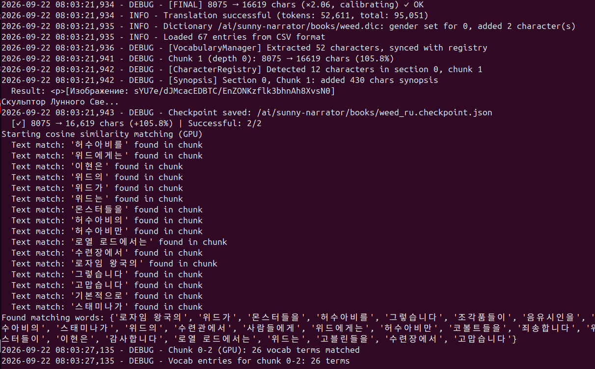

# Logging — Console Log and LLM Call Log

**Version:** 2.2

Sunny Narrator writes two independent logs:

| Log | Where | Enabled by |
|-----|-------|------------|
| **Console log** | stdout/stderr | always (`INFO`); `DEBUG=on` for details |
| **LLM call log** | `logs/llm_calls_YYYY-MM-DD.log` | `LLM_LOGGING=true` |

## ⚙️ Configuration (.env)

```bash
# Console log level: off → INFO, on → DEBUG
DEBUG=off

# With DEBUG=on, wire-level traces of httpx/httpcore/openai and duplicate
# pypandoc lines are suppressed; set on to see them too
DEBUG_HTTP=off

# Every LLM call as a JSON line
LLM_LOGGING=false
LLM_LOGGING_DIR=logs
```

## 🖥️ Console Log

Format: `timestamp - LEVEL - message`.



What the screenshot shows (Korean → Russian, `DEBUG=on`):

| Line | Meaning |
|------|---------|
| `[FINAL] 8075 → 16619 chars (×2.06, calibrating) ✓ OK` | Length check of the final translation. `calibrating` — fewer than 3 chunks accepted so far, only gross failures are rejected; afterwards it reads `expected ×N.NN` (the book's median ratio) |
| `Dictionary …/weed.dic: gender set for 0, added 2 character(s)` | Genders reported by the synopsis were written into the dictionary: empty gender fields filled, new characters appended |
| `Loaded 67 entries from CSV format` / `Extracted 52 characters, synced with registry` | The dictionary is reloaded so the next chunk already sees the new genders |
| `Chunk 1 (depth 0): 8075 → 16619 chars (105.8%)` | Chunk summary: source → translation length. `depth` > 0 means the chunk was split (rechunking) |
| `[CharacterRegistry] Detected 12 characters …` / `[Synopsis] … added 430 chars synopsis` | Characters found in the chunk and the synopsis carried to the next chunk |
| `Checkpoint saved: …/weed_ru.checkpoint.json` | Progress saved — a restart resumes from here ([RESUME.md](RESUME.md)) |
| `Text match: '위드가' found in chunk` | Dictionary terms found in the next chunk by exact text match; the rest are searched by cosine similarity ([NER_GUIDE.md](NER_GUIDE.md)) |
| `Chunk 0-2 (GPU): 26 vocab terms matched` | Number of dictionary entries passed to the translation prompt |

### Messages worth attention

| Message | Level | What to do |
|---------|-------|------------|
| `⚠ SPLIT [FINAL] … rechunking needed` | ERROR | The translation length deviates from the expected ratio by more than `LENGTH_CHECK_THRESHOLD` — the chunk is split and retranslated ([RECHUNKING_GUIDE.md](RECHUNKING_GUIDE.md)) |
| `RECHUNK FAIL-FAST …` | ERROR | Half of a split chunk came back empty — the chunk is not assembled from partial results |
| `LLM call cap (…) reached` | WARNING | The per-chunk LLM call limit was hit; check the model and the chunk |
| `Empty synopsis returned` | WARNING | The next chunk is translated without synopsis context |

## 📄 LLM Call Log

With `LLM_LOGGING=true` every LLM call is appended as one JSON line to `LLM_LOGGING_DIR/llm_calls_YYYY-MM-DD.log`:

| Field | Content |
|-------|---------|
| `timestamp` | ISO time of the call |
| `stage` / `role` | Pipeline stage (`initial`, `reflection`, `improve`, `final`, `synopsis`) and LLM role (`translate`/`proofread`) |
| `model`, `temperature` | Model and temperature used |
| `duration_ms` | Call duration |
| `tokens_input`, `tokens_output`, `tokens_total` | Token usage |
| `prompt_system`, `prompt_user`, `response` | Full prompts and raw response |

Useful for debugging prompts, auditing quality and measuring cost. The file grows quickly — full prompts are stored for every stage of every chunk.

```bash
# Tokens per stage for today
jq -r '[.stage, .tokens_total] | @tsv' logs/llm_calls_$(date +%F).log
```
